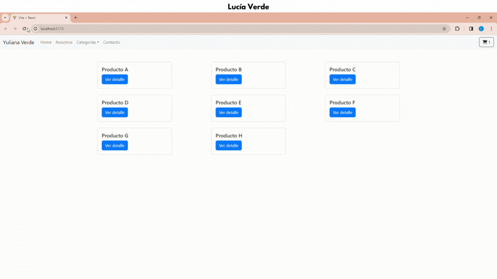

# Gallery 

Gallery es una e-commerce desarrollada como proyecto final para el curso de React JS de Coderhouse. Consiste en una tienda de obras de arte que permite a los usuarios explorar los productos, agregarlos al carrito y completar el proceso del pedido mediante un checkout que consta de un formulario en donde el usuario debe ingresar sus datos para generar la orden.

## Como funciona

Cuando un usuario accede a la aplicación, se encuentra con un catálogo de productos que muestra imágenes, nombres y un botón para acceder a detalles. Estos productos también pueden ser visualizados por categoría.

Al explorar un producto en particular, se despliega información adicional, como precio y descripción. Además, se presentan opciones para ajustar la cantidad, agregar al carrito y, una vez seleccionado "terminar compra", dirigirse al carrito.

Dentro del carrito, se visualizan los productos añadidos, permitiendo tanto la modificación de cantidades como la eliminación individual de los mismos con un impacto directo en el costo total de la orden. Además, se incluyen botones para vaciar el carrito y para proceder a la compra, redirigiendo al usuario a un formulario.

En este formulario, el usuario completa su nombre y correo electrónico para finalmente generar la orden. Esta orden se almacena en la base de datos, y como respuesta, se devuelve un número de identificación de la orden para su referencia.

## Tecnologías

La aplicación se desarrolló con React Js y una librería de estilo como React Bootstrap. Se utilizó React Router Dom para establecer rutas de navegación y esta conectada a una base de datos (Firebase) de donde se obtienen los productos.
 

## Implementaciones futuras

Para futuras mejoras, me gustaría:

- Mejorar la interfaz en terminos de adaptabilidad a diferentes pantallas.
  
- Incorporar animaciones utilizando bibliotecas como "Animated on Scroll" y "Animate", para darle un toque dinámico a la experiencia del usuario.

- Implementar un detalle de carrito en la esquina superior derecha, bajo el icono del carrito, que se despliegue de manera instantánea cada vez que se añada un producto. Esto permitirá a los usuarios acceder rápidamente a la información esencial del carrito sin interrumpir su experiencia de navegación.

- Desarrollar páginas adicionales como "Nosotros" y "Contacto" y asegurarse de que la navegabilidad entre estas páginas y la página principal ("Home") sea fluida y coherente.

- Implementar Local Storage para que al actualizar la página no se borre el contenido del carrito.

